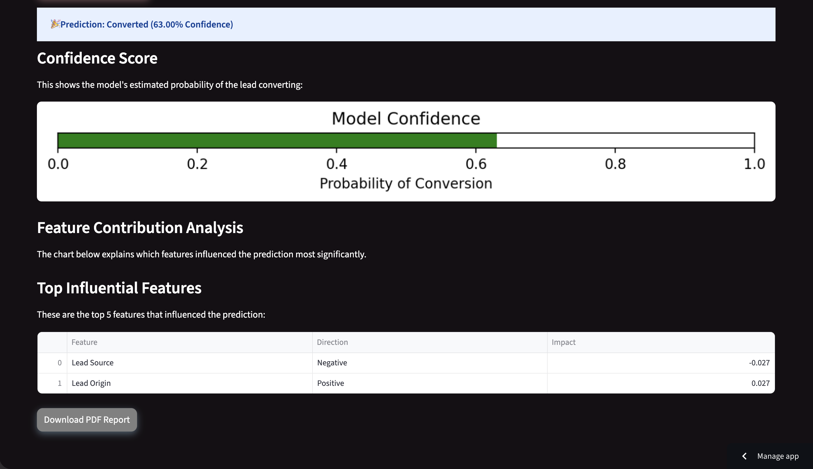

# Problem Statement
We were presented with an industry-based problem centered around improving the efficiency of lead management and conversion prediction. In many real-world businesses, sales and marketing teams often struggle with prioritizing leads due to the absence of accurate data-driven insights. This leads to wasted efforts on unqualified leads and missed opportunities with high-potential prospects.

To address this challenge, we developed an AI-powered lead conversion prediction system. The core objective of this project was to:

Predict whether a lead is likely to convert based on historical and behavioral data.
Provide interpretability behind each prediction using SHAP (SHapley Additive exPlanations).
Enable real-time decision-making for sales teams through a user-friendly web application.

The solution involved building a machine learning pipeline using a Random Forest classifier, which was trained and validated on real lead data. 

The model was then integrated into a fully interactive Streamlit web application, capable of:

Taking user input or uploaded lead data
Predicting lead conversion likelihood
Visualizing feature importance and confidence levels
Generating a downloadable PDF report for business use

## Predictive Lead Conversion

A machine learning-based system that predicts the likelihood of a sales lead converting, using behavioral and demographic data. Designed to support targeted marketing strategies by identifying high-potential leads.
## 🖼️ App Preview

### 🎨 User Interface

---
## 🔄 What is Lead Management?

Lead management is a strategic process that guides potential customers through a structured journey from initial contact to final conversion. It plays a crucial role in optimizing marketing and sales operations, ensuring no potential customer is lost due to inefficiencies or oversight.

The process typically involves the following three stages:

### 1. 🎯 Lead Generation
This is the initial phase where leads (potential customers) are acquired. It includes methods like:
- Digital advertisements
- Social media marketing
- Landing pages
- Third-party sources
- Email campaigns
- Organic search engine traffic

The goal is to attract individuals who show interest in the business offerings.

### 2. ✅ Lead Qualification
Once leads are collected, they are evaluated to determine their likelihood of becoming paying customers. Evaluation is based on:
- Demographic details
- Behavioral patterns (e.g., time on site, pages visited)
- Engagement history

The aim is to **prioritize high-potential leads** for the sales team.

### 3. 💼 Lead Conversion
This final stage is about turning qualified leads into customers. It includes:
- Personalized communication
- Follow-ups
- Product demos
- Special offers

The success of this stage determines the effectiveness of the entire lead management pipeline.

---

### Figure 1: Lead Management Flow with ML Model Integration

> The diagram below demonstrates how a Machine Learning model can be embedded into the lead qualification stage to improve decision-making and lead prioritization.

  <!-- Replace with your actual image file path -->

---
### Figure 2: Sales funnel from raw leads to conversions through
lead nurturing and ML-based scoring.

 
---
## 🚀 Features

- ✅ Real-time lead conversion prediction
- 📈 Confidence score visualization
- 🔍 SHAP-based feature contribution analysis
- 📝 Downloadable PDF prediction report
- 🎨 Stylish and interactive Streamlit UI
- ⚡ Lightweight and fast – ready for real-world use

---

## 📊 Model Details

- **Algorithm**: Random Forest Classifier
- **Accuracy**: 84%
- **ROC-AUC Score**: 0.89
- **Interpretability**: SHAP (SHapley Additive exPlanations)

---

## 🧠 Tech Stack

- Python 3.9+
- Streamlit
- pandas, matplotlib
- SHAP
- FPDF
- joblib, pickle

---

## 🛠️ Installation

1. Clone the Repository:
    
git clone https://github.com/yourusername/predictive-lead-conversion.git        
cd predictive-lead-conversion      

2. **Install Dependencies**:     
pip install -r requirements.txt            
Run the App Locally:        

3. **Run the App Locally**:   
streamlit run app.py          
ℹ️ Make sure rf_model.pkl, label_encoders.pkl, x_columns.pkl, and X_train.pkl are present in the root folder.       

🧾 Sample Output

After prediction, the app generates:       

📊 Prediction result (Converted / Not Converted)       
📌 SHAP-based top 5 influencing features       
📄 Downloadable PDF report with lead inputs, model summary, and business ROI      

📥 Files Included      
├── app.py                    # Main Streamlit app    
├── rf_model.pkl              # Trained Random Forest model    
├── label_encoders.pkl        # Encoders for categorical variables     
├── x_columns.pkl             # Feature column order     
├── X_train.pkl               # Training data for SHAP     
├── requirements.txt          # Python dependencies     
└── README.md                 # This file     

📚 How to Use   

Fill in lead information manually or load a sample.    
Click Predict Conversion.    
Analyze prediction, top features, and explanation.    
Download the PDF report for sharing or records.   

---

## 📬 Contact

For any questions or collaboration requests, feel free to reach out:       
**Mahek Agrawal**       
📧 mahek.suresh.aug2004@gmail.com      
[LinkedIn](https://linkedin.com/in/mahek-agrawal-503819255)    
